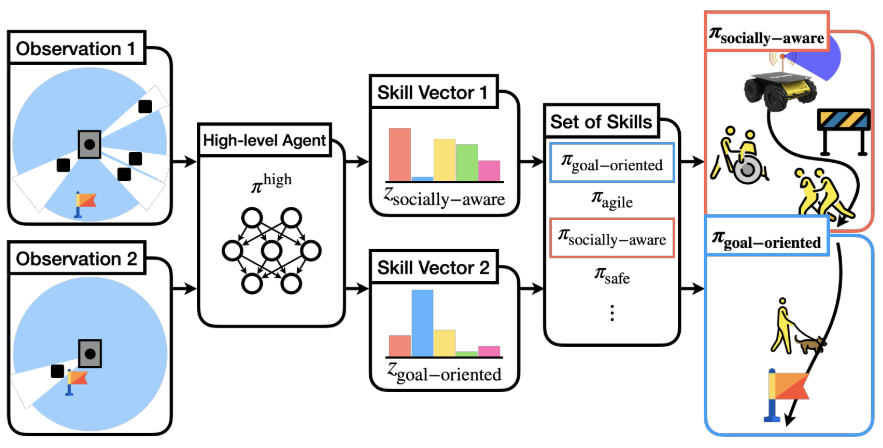

# hrl-nav


This repository provides the source codes for our paper ["Adaptive and Explainable Deployment of Navigation Skills via Hierarchical Deep Reinforcement Learning"](https://arxiv.org/pdf/2305.19746.pdf) in ICRA 2023.

## Abstract

For robotic vehicles to navigate robustly and safely in unseen environments, it is crucial to decide the most suitable navigation policy. However, most existing deep reinforcement learning based navigation policies are trained with a hand-engineered curriculum and reward function which are difficult to deploy in a wide range of real-world scenarios. In this paper, we propose a framework to learn a family of low-level navigation policies and a high-level policy for deploying them. The main idea is that, instead of learning a single navigation policy with a fixed reward function, we simultaneously learn a family of policies that exhibit different behaviors with a wide range of reward functions. We then train the high-level policy which adaptively deploys the most suitable navigation skill. We evaluate our approach in simulation and the real world and demonstrate that our method can learn diverse navigation skills and adaptively deploy them. We also illustrate that our proposed hierarchical learning framework presents explainability by providing semantics for the behavior of an autonomous agent.

<p align="center">

</p>

## Install

The package has been tested on Ubuntu 18.04 / Python 3.6. 

Please refer to [nav-gym](https://github.com/leekwoon/nav-gym) repo to install a navigation simulator. After finishing installation of nav-gym:


```bash
git clone https://github.com/leekwoon/hrl-nav.git

cd hrl-nav
pip install -e .
```

## Training

1. train low-level agent with:

```bash
python -m examples.train_low_level --base_logdir /tmp --seed 0
```

2. train high-level agent with:

```bash
# use correct path!
python -m examples.train_high_level --base_logdir /tmp --seed 0 --low_level_agent_params /tmp/...LOW_LEVEL_PATH.../itr_120.pkl
```

## Testing

```bash
python -m examples.test --scenario atc --low_level_agent_params /tmp/...LOW_LEVEL_PATH.../itr_120.pkl --high_level_agent_params /tmp/...HIGH_LEVEL_PATH.../itr_80.pkl --spec atc
```

## Authors

Kyowoon Lee\*<sup>1</sup>(leekwoon@unist.ac.kr), Seongun Kim\*<sup>2</sup>(seongun@kaist.ac.kr), Jaesik Choi<sup>2</sup>(jaesik.choi@kaist.ac.kr)

<sup>1</sup>[UNIST](http://www.unist.ac.kr/) @ Department of Computer Science and Engineering, UNIST, Ulsan, Republic of Korea.

<sup>2</sup>[KAIST](http://kaist.ac.kr/kr/) @ Graduate School of Artificial Intelligence, KAIST, Daejeon, Republic of Korea. 

\* Equal contribution

## Reference

```
@article{lee2023adaptive,
  title={Adaptive and Explainable Deployment of Navigation Skills via Hierarchical Deep Reinforcement Learning},
  author={Lee, Kyowoon and Kim, Seongun and Choi, Jaesik},
  journal={arXiv preprint arXiv:2305.19746},
  year={2023}
}
```

## Credits

The codebase is extended from the [rlkit codebase](https://github.com/rail-berkeley/rlkit). 
